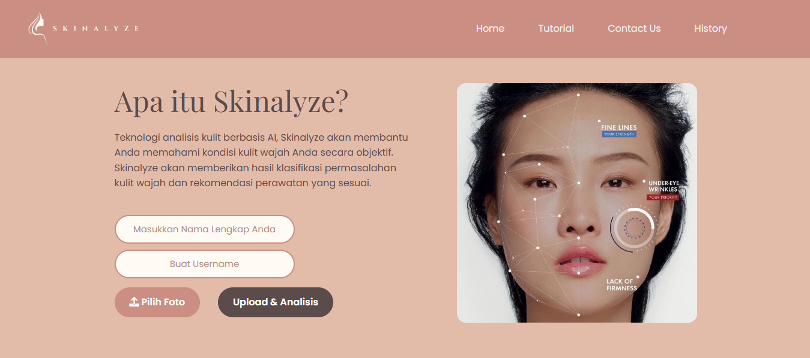

# 🩺 Skinalyze: Skin Problem Detection


## 📖 Gambaran Singkat

Aplikasi ini adalah sistem berbasis web yang dibangun untuk mendeteksi dan mengklasifikasikan jenis penyakit kulit secara otomatis menggunakan teknologi **Deep Learning**.

Sistem ini menggunakan arsitektur **ResNet** (`resnetrms.h5`) untuk mengenali pola pada citra kulit dan memberikan prediksi klasifikasi penyakit. Aplikasi ini dirancang agar mudah digunakan oleh pengguna awam melalui antarmuka web yang sederhana.


---

## ⚙️ Cara Instalasi

Pastikan Python dan Git sudah terinstall di komputer Anda.

**1. Clone Repository**
Unduh source code ke komputer lokal Anda:
```bash
git clone [https://github.com/gracealynn/SKRIPSI.git](https://github.com/gracealynn/SKRIPSI.git)
```

**2. Install Dependencies**
Install semua library yang dibutuhkan (seperti Flask, TensorFlow, dll) yang sudah terdaftar di dalam file (`requirement.txt`).
```bash
pip install -r requirement.txt
```

**3. Jalankan Server**
Buka terminal di dalam folder project
```bash
python app.py
```

**4. Akses Web**
Buka browser dan kunjungi alamat: http://127.0.0.1:5000

---
## 📝 Catatan Penelitian

**Disclaimer:** Aplikasi ini dikembangkan sebagai bagian dari Penelitian Skripsi. Hasil prediksi hanyalah rujukan awal dan bukan pengganti diagnosa medis profesional.

---
**Created by FaithzaMandolang & gracealynn**
